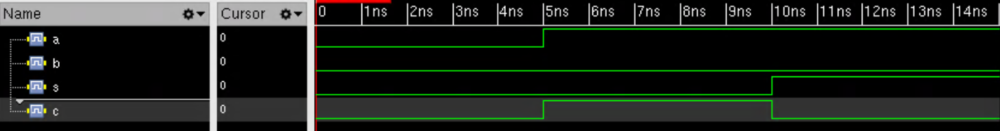

# Lab 1: Introduce Verilog HDL
## Description
Design a MUX in behavioral and structural style.
## Tools:
* Cadence XCelium
## Result:
* __Simulation waveform of structural style__:

* __Simulation waveform of behavioral style__:
