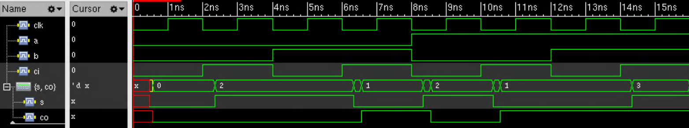

# Lab 2: Synthesize using Synopsys Design Compiler
## Description
Synthesize a full adder and simulate sythesized netlist.
## Tools:
* Synopsys Design Compiler
* Cadence XCelium
## Library
* __Technology library__: AMI 0.5
* __Standard library__: OSU05_stdcell
## Result:
* [__Synthesized netlist__](src/syn/full_adder_syn.v)
* __Area report__:  
    ```
    Cell                      Reference       Library             Area  Attributes
    --------------------------------------------------------------------------------
    U1                        OR2X1           osu05_stdcells  288.000000
    U2                        INVX2           osu05_stdcells  144.000000
    U3                        INVX2           osu05_stdcells  144.000000
    U4                        INVX2           osu05_stdcells  144.000000
    U5                        INVX2           osu05_stdcells  144.000000
    U6                        INVX2           osu05_stdcells  144.000000
    U7                        INVX2           osu05_stdcells  144.000000
    u1_half_adder             half_adder_1                    792.000000
                                                                        h
    u2_half_adder             half_adder_0                    792.000000
                                                                        h
    --------------------------------------------------------------------------------
    Total 9 cells                                             2736.000000
    1
    ```
* __Timing report__:
    ```
    Startpoint: a (input port clocked by clk)
    Endpoint: co (output port clocked by clk)
    Path Group: clk
    Path Type: max

    Point                                    Incr       Path
    -----------------------------------------------------------
    clock clk (rise edge)                    0.00       0.00
    clock network delay (ideal)              0.30       0.30
    input external delay                     2.00       2.30 f
    a (in)                                   0.07       2.37 f
    U6/Y (INVX2)                             0.08       2.45 r
    U7/Y (INVX2)                             0.12       2.57 f
    u1_half_adder/a (half_adder_1)           0.00       2.57 f
    u1_half_adder/U2/Y (XOR2X1)              0.27       2.84 f
    u1_half_adder/s (half_adder_1)           0.00       2.84 f
    u2_half_adder/b (half_adder_0)           0.00       2.84 f
    u2_half_adder/U1/Y (AND2X2)              0.22       3.06 f
    u2_half_adder/co (half_adder_0)          0.00       3.06 f
    U1/Y (OR2X1)                             0.35       3.41 f
    co (out)                                 0.00       3.41 f
    data arrival time                                   3.41

    clock clk (rise edge)                   40.00      40.00
    clock network delay (ideal)              0.30      40.30
    output external delay                   -1.65      38.65
    data required time                                 38.65
    -----------------------------------------------------------
    data required time                                 38.65
    data arrival time                                  -3.41
    -----------------------------------------------------------
    slack (MET)                                        35.24
    ```
* __Simulation waveform of synthesized netlist__:  

