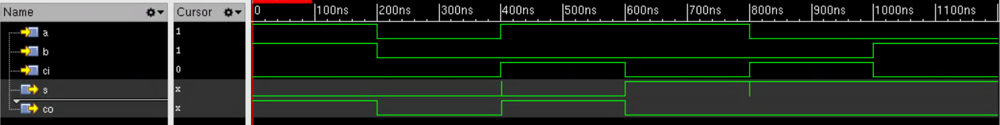
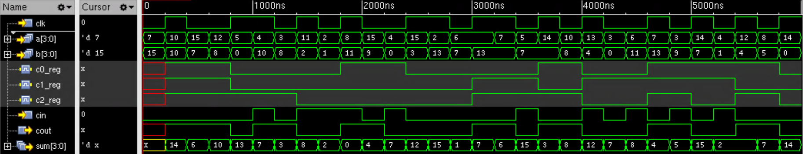

# Lab 4: Generate ATPG using Synopsys TetraMax
## Description
Generate Stuck-At Fault model ATPG patterns for synthesized full adder and ripplecarry (has no practical meaning, just for lab) and simulate the patterns.
## Tools:
* Synopsys TetraMax
* Cadence XCelium
## Result:
* __Pattern summary report for full adder__:
    ```
          Uncollapsed Stuck Fault Summary Report 
    ----------------------------------------------- 
    fault class                     code   #faults 
    ------------------------------  ----  --------- 
    Detected                         DT         64 
    Possibly detected                PT          0 
    Undetectable                     UD          0 
    ATPG untestable                  AU          0 
    Not detected                     ND          0 
    ----------------------------------------------- 
    total faults                                64 
    test coverage                           100.00% 
    ----------------------------------------------- 
                Pattern Summary Report 
    ----------------------------------------------- 
    #internal patterns                           6 
        #basic_scan patterns                     6 
    ----------------------------------------------- 
    ```
* __Simulation waveform of ATPG pattern of full adder__:
    
* __Pattern summary report for ripplecarry(sequential)__:
    ```
          Uncollapsed Stuck Fault Summary Report 
    ----------------------------------------------- 
    fault class                     code   #faults 
    ------------------------------  ----  --------- 
    Detected                         DT        238 
    Possibly detected                PT          2 
    Undetectable                     UD          0 
    ATPG untestable                  AU          0 
    Not detected                     ND          0 
    ----------------------------------------------- 
    total faults                               240 
    test coverage                            99.58% 
    ----------------------------------------------- 
                Pattern Summary Report 
    ----------------------------------------------- 
    #internal patterns                           7 
        #full_sequential patterns                7 
    ----------------------------------------------- 
    ```
* __Sumulation waveform of ATPG pattern of ripplecarry__:
    