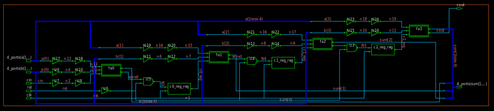
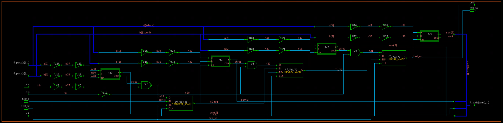
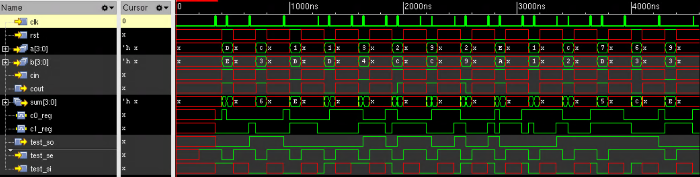

# Lab 5: Insert scan-chains using Synopsys Design Compiler
## Description
Insert scan-chains into ripplecarry module and synthesize it, then generate ATPG and simulate.
## Library
* __Technology library__: AMI 0.5
* __Standard library__: OSU05_stdcell
## Tools:
* Synopsys Design Compiler
* Synopsys TetraMax
* Cadence XCelium
## Result:
* __Synthesized schematic__:
    
* __Synthesized schematic with scan-chains__:
    
* __Synthesis timing report__:
    ```
    Startpoint: a[3] (input port clocked by clk)
    Endpoint: cout (output port clocked by clk)
    Path Group: clk
    Path Type: max

    Point                                    Incr       Path
    -----------------------------------------------------------
    clock clk (rise edge)                    0.00       0.00
    clock network delay (ideal)              0.30       0.30
    input external delay                     2.00       2.30 f
    a[3] (in)                                0.07       2.37 f
    U23/Y (INVX2)                            0.08       2.45 r
    U24/Y (INVX2)                            0.12       2.57 f
    fa3/a (fulladder_0)                      0.00       2.57 f
    fa3/ha1/a (halfadder_1)                  0.00       2.57 f
    fa3/ha1/U2/Y (XOR2X1)                    0.28       2.85 f
    fa3/ha1/s (halfadder_1)                  0.00       2.85 f
    fa3/ha2/a (halfadder_0)                  0.00       2.85 f
    fa3/ha2/U1/Y (AND2X2)                    0.25       3.10 f
    fa3/ha2/c (halfadder_0)                  0.00       3.10 f
    fa3/U1/Y (OR2X1)                         0.35       3.45 f
    fa3/cout (fulladder_0)                   0.00       3.45 f
    cout (out)                               0.00       3.45 f
    data arrival time                                   3.45

    clock clk (rise edge)                   40.00      40.00
    clock network delay (ideal)              0.30      40.30
    output external delay                   -1.65      38.65
    data required time                                 38.65
    -----------------------------------------------------------
    data required time                                 38.65
    data arrival time                                  -3.45
    -----------------------------------------------------------
    slack (MET)                                        35.20

    ```
* __Synthesis area report__:
    ```
    Cell                      Reference       Library             Area  Attributes
    --------------------------------------------------------------------------------
    U3                        AND2X2          osu05_stdcells  288.000000
    U4                        AND2X2          osu05_stdcells  288.000000
    U5                        AND2X2          osu05_stdcells  288.000000
    U6                        INVX2           osu05_stdcells  144.000000
    U7                        INVX2           osu05_stdcells  144.000000
    U8                        INVX2           osu05_stdcells  144.000000
    U9                        INVX2           osu05_stdcells  144.000000
    U10                       INVX2           osu05_stdcells  144.000000
    U11                       INVX2           osu05_stdcells  144.000000
    U12                       INVX2           osu05_stdcells  144.000000
    U13                       INVX2           osu05_stdcells  144.000000
    U14                       INVX2           osu05_stdcells  144.000000
    U15                       INVX2           osu05_stdcells  144.000000
    U16                       INVX2           osu05_stdcells  144.000000
    U17                       INVX2           osu05_stdcells  144.000000
    U18                       INVX2           osu05_stdcells  144.000000
    U19                       INVX2           osu05_stdcells  144.000000
    U20                       INVX2           osu05_stdcells  144.000000
    U21                       INVX2           osu05_stdcells  144.000000
    U22                       INVX2           osu05_stdcells  144.000000
    U23                       INVX2           osu05_stdcells  144.000000
    U24                       INVX2           osu05_stdcells  144.000000
    c0_reg_reg                DFFPOSX1        osu05_stdcells  864.000000
                                                                        n
    c1_reg_reg                DFFPOSX1        osu05_stdcells  864.000000
                                                                        n
    c2_reg_reg                DFFPOSX1        osu05_stdcells  864.000000
                                                                        n
    fa0                       fulladder_3                     1872.000000
                                                                        h
    fa1                       fulladder_2                     1872.000000
                                                                        h
    fa2                       fulladder_1                     1872.000000
                                                                        h
    fa3                       fulladder_0                     1872.000000
                                                                        h
    --------------------------------------------------------------------------------
    Total 29 cells                                            13680.000000
    ```
* __Synthesis scan path report__:
    ```
    Scan_path    Len   ScanDataIn  ScanDataOut ScanEnable  MasterClock SlaveClock
    -----------  ----- ----------- ----------- ----------- ----------- -----------
    I 1          3     test_si     test_so     test_se     clk         -
    ```
* __Synthesis with scan-chains area report__:
    ```
    Cell                      Reference       Library             Area  Attributes
    --------------------------------------------------------------------------------
    U7                        AND2X1          osu05_stdcells  288.000000
    U8                        AND2X1          osu05_stdcells  288.000000
    U9                        AND2X1          osu05_stdcells  288.000000
    U10                       INVX1           osu05_stdcells  144.000000
    U14                       INVX2           osu05_stdcells  144.000000
    U15                       INVX2           osu05_stdcells  144.000000
    U16                       INVX2           osu05_stdcells  144.000000
    U17                       INVX2           osu05_stdcells  144.000000
    U18                       INVX2           osu05_stdcells  144.000000
    U19                       INVX2           osu05_stdcells  144.000000
    U20                       INVX2           osu05_stdcells  144.000000
    U21                       INVX2           osu05_stdcells  144.000000
    U22                       INVX2           osu05_stdcells  144.000000
    U23                       INVX2           osu05_stdcells  144.000000
    U24                       INVX2           osu05_stdcells  144.000000
    U25                       INVX2           osu05_stdcells  144.000000
    U26                       INVX2           osu05_stdcells  144.000000
    U27                       INVX2           osu05_stdcells  144.000000
    U28                       INVX2           osu05_stdcells  144.000000
    U29                       INVX2           osu05_stdcells  144.000000
    U30                       INVX2           osu05_stdcells  144.000000
    U31                       INVX2           osu05_stdcells  144.000000
    c0_reg_reg                DFFPOSX1_SCAN   osu_scan        1440.000000
                                                                        n
    c1_reg_reg                DFFPOSX1_SCAN   osu_scan        1440.000000
                                                                        n
    c2_reg_reg                DFFPOSX1_SCAN   osu_scan        1440.000000
                                                                        n
    fa0                       fulladder_3                     1872.000000
                                                                        h
    fa1                       fulladder_2                     1872.000000
                                                                        h
    fa2                       fulladder_1                     1872.000000
                                                                        h
    fa3                       fulladder_0                     1872.000000
                                                                        h
    --------------------------------------------------------------------------------
    Total 29 cells 
    ```
* __ATPG summary report__:
    ```
          Collapsed Stuck Fault Summary Report
    -----------------------------------------------
    fault class                     code   #faults
    ------------------------------  ----  ---------
    Detected                         DT        136
    Possibly detected                PT          0
    Undetectable                     UD          0
    ATPG untestable                  AU          0
    Not detected                     ND          0
    -----------------------------------------------
    total faults                               136
    test coverage                           100.00%
    -----------------------------------------------
        Collapsed Stuck Fault Summary Report
    -----------------------------------------------
    fault class                     code   #faults
    ------------------------------  ----  ---------
    Detected                         DT        136
    Possibly detected                PT          0
    Undetectable                     UD          0
    ATPG untestable                  AU          0
    Not detected                     ND          0
    -----------------------------------------------
    total faults                               136
    test coverage                           100.00%
    -----------------------------------------------
    ```
* __Simulation waveform with ATPG pattern__:
    