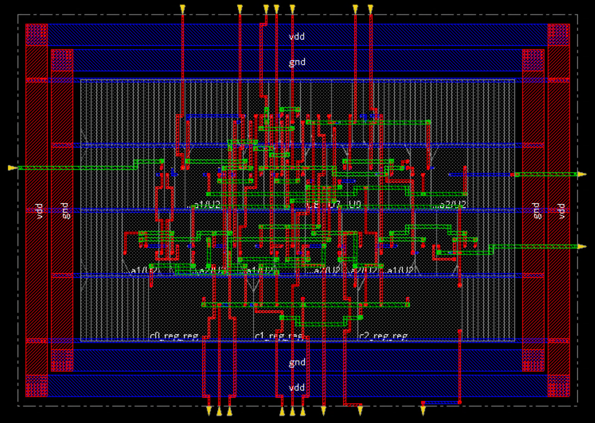
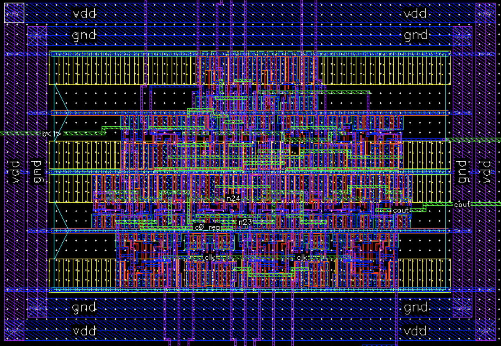
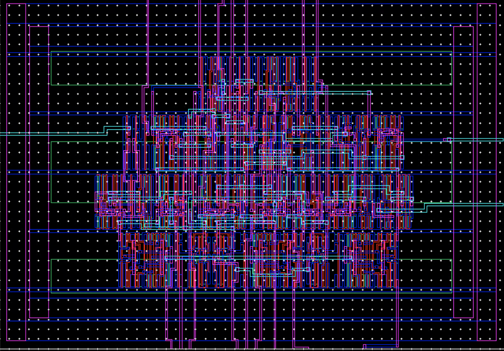

# Lab 7: Place & Route synthesized netlist using Cadence Innovus
## Description
Place & Route ripplecarry module with scan-chains inserted, then do LVS between extracted layout and schematic.
## Tools:
* Cadence Innovus
* Cadence Virtuoso
## Result:
* __Place & Route abstract layout in Innovus__:
    
* __Remastered layout in Virtuoso__:
    
* __Extracted layout in Virtuoso__:
    
* __LVS report__:
    ```
    Net-list summary for /home/ead/yihui/cadence/LVS/layout/netlist
        count
            195             nets
            19              terminals
            163             pmos
            163             nmos

    Net-list summary for /home/ead/yihui/cadence/LVS/schematic/netlist
        count
            195             nets
            21              terminals
            163             pmos
            163             nmos


    Terminal correspondence points
        N181      N42       a<0>
        N178      N32       a<1>
        N176      N37       a<2>
        N193      N36       a<3>
        N189      N43       b<0>
        N188      N30       b<1>
        N186      N34       b<2>
        N184      N33       b<3>
        N191      N29       cin
        N185      N27       clk
        N187      N45       cout
        N180      N31       rst
        N183      N41       sum<0>
        N182      N40       sum<1>
        N179      N39       sum<2>
        N177      N38       sum<3>
        N194      N44       test_se
        N192      N28       test_si
        N190      N46       test_so

    Devices in the netlist but not in the rules:
            pcapacitor
    Devices in the rules but not in the netlist:
            cap nfet pfet nmos4 pmos4

    The net-lists match.
    ```