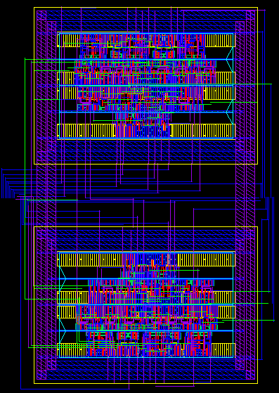

# Lab 8: Automatically route modules within padframe using Cadence Virtuoso
## Description
Combine two ripplecarry modules and automatically route them with a padfram, then do LVS between schematic and extracted layout.
## Tools:
* Cadence Virtuoso
## Result:
* __Schematic of combined 2 ripplecarrys__:  
    
* ___Routed layout of combined 2 ripplecarrys__:  
    
* __Routed extracted layout of combined 2 ripplecarrys__:  
    
* __Schematic of wholechip(combined 2 ripplecarrys inside padframe)__:  
    
* __Routed layout of wholechip(combined 2 ripplecarrys inside padframe)__:  

    | Pin Name | Pad Number | Pad Type |
    |  ----  | ----  | ---- |
    |cin|27|pad_in|
    |clk|28|pad_in|
    |rst|29|pad_in|
    |test_se|30|pad_in|
    |test_si|31|pad_in|
    |cout|79|pad_out|
    |test_so_0|78|pad_out|
    |test_so_1|77|pad_out|
    |vdd|57|pad_vdd|
    |gnd|7|pad_gnd|  

    
* __Extracted routed layout of wholechip(combined 2 ripplecarrys inside padframe)__:  
    
* __LVS report of wholechip__:
    ```
    Net-list summary for /home/ead/yihui/cadence/LVS/layout/netlist
       count
        434             nets
        0               terminals
        622             pmos
        622             nmos

    Net-list summary for /home/ead/yihui/cadence/LVS/schematic/netlist
       count
        434             nets
        10              terminals
        392             pmos
        392             nmos

    Devices in the netlist but not in the rules:
            pcapacitor
    Devices in the rules but not in the netlist:
            cap nfet pfet nmos4 pmos4

    8 net-list ambiguities were resolved by random selection.

    The net-lists match.
    ```